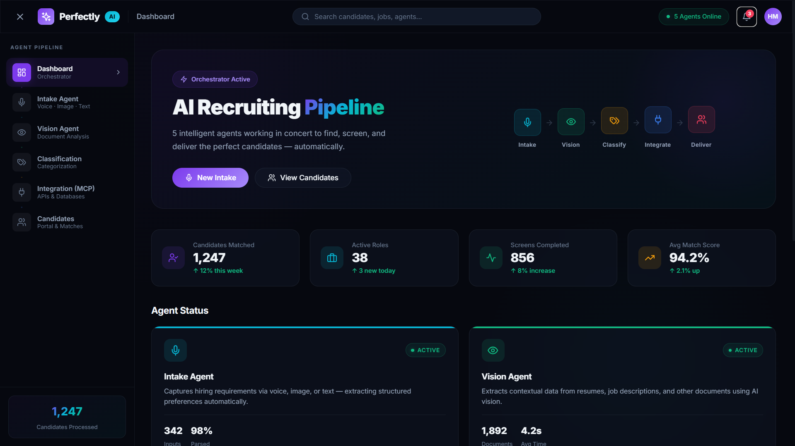
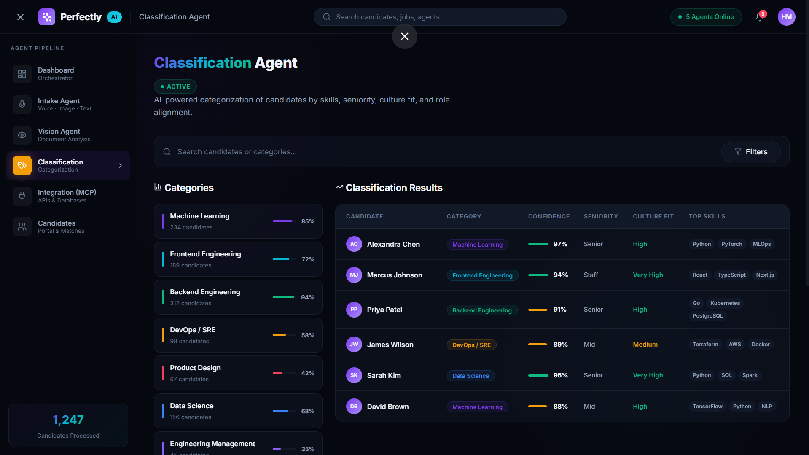

Perfectly AI is an innovative, AI-powered recruiting agency platform designed to streamline and enhance the hiring process. By leveraging advanced AI agents for intake, vision analysis, candidate classification, and seamless integration, Perfectly AI offers a modern solution for recruiters and hiring managers.

## Screenshots

## 🚀 Features

The platform is built around a suite of intelligent agents and a comprehensive dashboard:

*   *Intake Agent*: Collects detailed job requirements and hiring preferences from users through a conversational interface.
*   *Vision Agent*: Analyzes candidate resumes and other documents using advanced computer vision capabilities.
*   *Classification Agent*: Automatically categorizes candidates based on their skills, experience, and cultural fit.
*   *Integration Agent*: Manages connections with external applicant tracking systems (ATS) and other tools.
*   *Candidates Portal*: A centralized view to manage and review candidate profiles, including AI-generated insights and scores.
*   *Dashboard*: An overview of recruitment activities, agent status, and key metrics.

## 🛠️ Tech Stack

### Frontend
*   *React* (v18)
*   *Vite* (Build tool)
*   *Tailwind CSS* (Styling)
*   *Framer Motion* (Animations)
*   *React Router* (Navigation)

### Backend
*   *FastAPI* (Python Web Framework)
*   *SQLAlchemy + aiosqlite* (Async Database ORM)
*   *Google Gemini AI* (LLM & Vision capabilities)
*   *Pydantic* (Data validation)

## 📋 Prerequisites

Before you begin, ensure you have the following installed:
*   *Node.js* (v16+. LTS recommended)
*   *Python* (v3.8+)

## ⚙️ Installation & Setup

Follow these steps to set up the project locally.

### 1. Clone the Repository

git clone https://github.com/srimichael20/RecruitAI.git

cd recuritai

### 2. Backend Setup
Navigate to the backend directory and set up the Python environment:

bash
cd backend

# Create a virtual environment
python -m venv venv

# Activate the virtual environment
# Windows:
venv\Scripts\activate
# Mac/Linux:
# source venv/bin/activate

# Install dependencies
pip install -r requirements.txt

### 3. Frontend Setup
Open a new terminal, navigate to the root directory (or src parent), and install Node dependencies:

bash
# (Assuming you are in the project root)
npm install

## 🔑 Configuration

1.  *Backend Environment Variables*:
    *   Navigate to the backend directory.
    *   Create a .env file (you can copy from .env.example if available).
    *   Add your Google Gemini API key:
        env
        GEMINI_API_KEY=your_api_key_here
        

## ▶️ Usage

### Start the Backend Server
In your backend terminal (with virtual environment activated):

bash
cd backend
uvicorn main:app --reload

The API will be available at http://localhost:8000.
API Documentation (Swagger UI): http://localhost:8000/docs

### Start the Frontend Application
In your frontend terminal:

bash
npm run dev

The application will be available at https://recruitai-04.vercel.app/

The application will be available at http://localhost:5173.

### 🧩 Folder Description

- **dist/** – Contains optimized production build files.
- **node_modules/** – Installed frontend packages and dependencies.
- **src/** – Main frontend source code (React).
  - **components/** – Reusable UI components.
  - **pages/** – Core application pages like Dashboard, Agents, etc.
  - **App.jsx** – Root React component.
  - **main.jsx** – Frontend entry file.
- **backend/** – FastAPI backend handling APIs, AI logic, and database.
  - **routers/** – API endpoint modules.
  - **services/** – Core logic, AI models, and integrations.
  - **models.py** – Database schema definitions.
  - **schemas.py** – Request/response validation using Pydantic.
  - **main.py** – Backend server entry point.
  - **requirements.txt** – Backend dependencies list.
  
---
